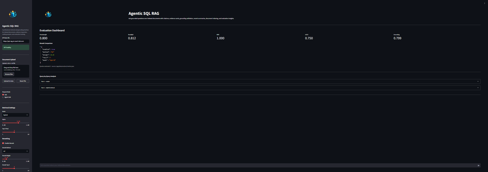
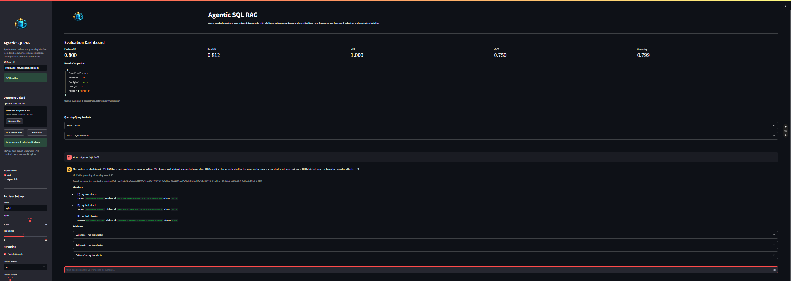
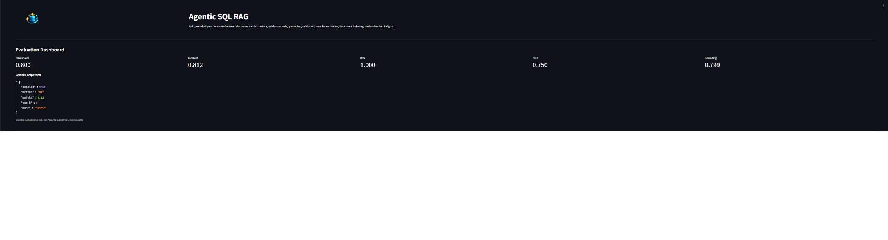
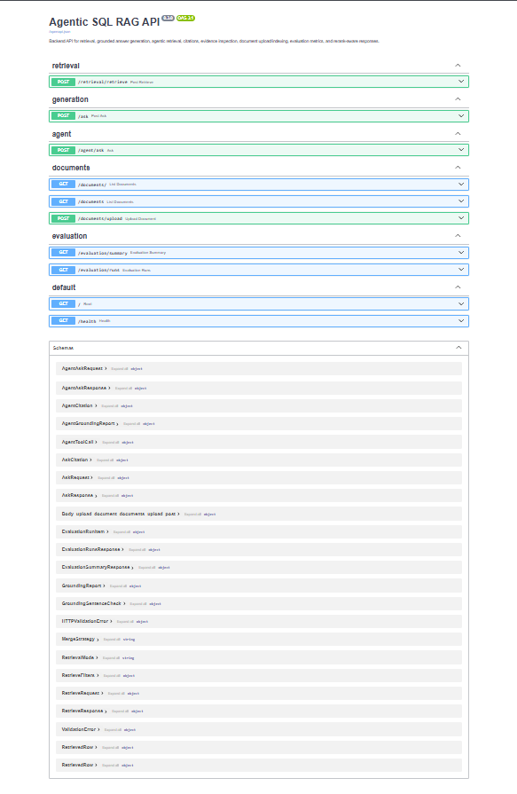

# 🔎 Agentic SQL RAG (Hybrid Retrieval + Evaluation Dashboard)

**A Retrieval-Augmented Generation System with Hybrid Search, Reranking, and Retrieval Evaluation**

Agentic SQL RAG is a production-style **retrieval engineering system** designed to support grounded question answering over indexed documents.  
The system combines **document ingestion, hybrid retrieval, reranking, evidence inspection, and evaluation metrics** to make RAG systems **measurable, reproducible, and explainable**.

> ⚠️ This project focuses on **retrieval engineering and evaluation**.  
> The UI and agent components exist **only to present retrieval results and metrics**, not to replace them.

  
  
  
  
  
  

# 🌐 Live App URLs

- **UI (Streamlit):** https://rag.ai-coach-lab.com  
- **API (FastAPI):** https://api-rag.ai-coach-lab.com  
- **API Docs (Swagger):** https://api-rag.ai-coach-lab.com/docs  
- **Health:** https://api-rag.ai-coach-lab.com/health  

> These interfaces exist primarily for **demonstration and reproducibility**.  
> The core contribution is the **retrieval architecture and evaluation system**.

# 📌 Project Motivation

Many RAG demos appear impressive but fail to provide **transparent retrieval logic or measurable evaluation**.

Common problems include:

- hidden retrieval steps
- lack of evidence inspection
- no evaluation metrics
- poor reproducibility

Agentic SQL RAG addresses these problems by providing:

- hybrid retrieval
- grounded citations
- evaluation metrics
- query-by-query analysis
- reproducible cloud deployment

The goal is to treat RAG systems as **engineering systems that can be measured and improved**, not just prompt-based demos.

# 🧠 Retrieval Engineering Contributions

### Document Ingestion

The system supports ingestion of structured text documents with:

- `.txt` and `.md` uploads
- chunking with overlap
- deterministic chunk identifiers
- character offsets for evidence grounding

### Hybrid Retrieval Engine

The system combines **two retrieval approaches**:

| Retrieval Method | Purpose |
|------------------|--------|
| PostgreSQL Full-Text Search | lexical keyword matching |
| Vector-style similarity | semantic matching |
| Hybrid scoring | combine lexical + semantic signals |

Hybrid ranking improves retrieval stability and robustness.

### Reranking Layer

An optional reranking stage improves final document ordering.

Capabilities include:

- rerank weight control
- hybrid score inspection
- improved evidence ordering

### Evidence Grounding

Each generated answer includes:

- supporting document chunks
- source citations
- evidence inspection

This makes retrieval behavior **transparent and explainable**.

# 📊 Retrieval Evaluation

A built-in evaluation dashboard measures retrieval performance.

### Metrics

| Metric | Purpose |
|------|--------|
| Precision@K | relevance of retrieved documents |
| Recall@K | coverage of relevant documents |
| MRR | ranking quality |
| nDCG | graded relevance evaluation |
| Grounding Score | quality of answer citations |

### Query-Level Analysis

The evaluation dashboard supports:

- query-by-query inspection
- rerank comparison
- retrieval mode comparison

This allows systematic improvement of retrieval pipelines.

# 🏗️ System Architecture

### High-Level Retrieval Flow

1. User submits a question  
2. Query is processed by retrieval engine  
3. Hybrid search retrieves document chunks  
4. Optional reranking improves ordering  
5. Evidence chunks are attached to answer  
6. Results are displayed in UI  

### 📐 Production Architecture

This architecture provides:

- public demo deployment
- reproducible infrastructure
- scalable cloud hosting

## 🖼️ Application Screenshots

### Streamlit UI — Retrieval Dashboard

### Query Results with Evidence

### Evaluation Dashboard

### FastAPI Swagger Documentation

# 🧰 Technology Stack

### Frontend
- Streamlit

### Backend
- FastAPI
- Python

### Database
- PostgreSQL (Neon)

### Retrieval Engine
- PostgreSQL Full-Text Search
- Hybrid retrieval logic
- Reranking module

### Deployment
- Docker
- Azure App Service
- Cloudflare DNS + SSL

# 🗂️ Repository Structure

# 📈 Why This Project Matters

This repository demonstrates practical skills in:

- retrieval engineering
- backend API development
- database-backed RAG systems
- evaluation-driven AI systems
- full-stack AI deployment

# 👨‍💻 Author

**Cristian Reynoso-Betancourt**

Part of a broader applied AI portfolio including:

- AI Architecture Designer
- AI Interview Coach
- AI Market Coach
- Retrieval systems and evaluation frameworks

